# Numerical simulation of a structure-preserving idealized stochastic climate model
This repository contains code for the simulation of a structure-preserving idealized stochastic climate model. 

## The climate model
The climate model can be described by 

  

<!-- $$
\begin{align*}
\text{Atmosphere}: \ &\mathrm{d} \mathbf{u}^a + (\mathbf{u}^a \mathrm{d} t + \sum_i \boldsymbol{\xi}_i \circ \mathrm{d} W^i_t)\cdot \nabla \mathbf{u}^a + \frac{1}{Ro^a} \hat{\mathbf{z}} \times \mathbf{u}^a\mathrm{d} t \\
                &\qquad \qquad + \sum_i (u_1^a \nabla \xi_{i,1} + u_2^a \nabla \xi_{i,2} )\circ \mathrm{d} W^i_t = (-\frac{1}{C^a} \nabla \theta + \nu^a \Delta \mathbf{u}^a) \mathrm{d} t, \\
        &\mathrm{d} \theta^a + \nabla\cdot (\theta^a \mathbf{u}^a)\mathrm{d} t + \sum_i (\boldsymbol{\xi}_i \circ \mathrm{d} W^i_t) \cdot \nabla \theta^a = (\gamma(\theta^a - \theta^o) + \nu^a \Delta \theta )\mathrm{d} t,\\
\text{Ocean}: \ &\frac{\partial \mathbf{u}^o}{\partial t} + (\mathbf{u}^o\cdot \nabla)\mathbf{u}^o + \frac{1}{Ro^o} \hat{\mathbf{z}} \times \mathbf{u}^o + \frac{1}{Ro^o} \nabla p^a = \sigma(\mathbf{u}^o - \mathbb{E}\mathbf{u}_{sol}^a) + \nu^o \Delta \mathbf{u}^o,\\
    & \nabla \cdot \mathbf{u}^o = 0,\\
    &\frac{\partial \theta^o}{\partial t} + \mathbf{u}^o \cdot \nabla \theta^o = \eta^o \Delta \theta^o,
\end{align*}
$$ -->
where the vector variable $\mathbf{{u}}$ and the scalar variables $\theta$ and  $p$ (with superscripts for the atmosphere and ocean components) denote the velocity, temperature, and pressure fields, respectively. $W_t^i$ are independent Brownian motions and, $u_j^a$ and $\xi_{i,j}$ denote the $j$ th components of atmosphere velocity $\mathbf{u}^a$ and the spatial correlation vectors $\boldsymbol{\xi}_i$, respectively.

We discretize the climate model equations using finite element method (FEM) and solve the discrete equations on [Firedrake](https://www.firedrakeproject.org/) open-source package. The simulation results are visualized using [Paraview](https://www.paraview.org/). 
## Model calibration
One of the first steps in the numerical simulation of stochastic climate model is the model calibration. This involves estimation of the unknown correlation vectors $\boldsymbol{\xi}_i$ representing the unresolved transport dynamics. In our work, we use data from high-resolution simulation of the deterministic version of the climate model to determine $\boldsymbol{\xi}_i$.

The deterministic climate model equations are 
$$
\begin{align*}
    \text{Atmosphere}: \ &\frac{\partial \mathbf{u}^a}{\partial t} + (\mathbf{u}^a\cdot \nabla)\mathbf{u}^a + \frac{1}{Ro^a} \hat{\mathbf{z}} \times \mathbf{u}^a + \frac{1}{C^a} \nabla \theta^a = {\nu}^a \Delta \mathbf{u}^a, \\
        &\frac{\partial \theta^a}{\partial t} + \nabla \cdot (\mathbf{u}^a \theta^a) = \gamma(\theta^a - \theta^o) + \eta^a \Delta \theta^a,\\
    \text{Ocean}: \ &\frac{\partial \mathbf{u}^o}{\partial t} + (\mathbf{u}^o\cdot \nabla)\mathbf{u}^o + \frac{1}{Ro^o} \hat{\mathbf{z}} \times \mathbf{u}^o + \frac{1}{Ro^o} \nabla p^o = \sigma(\mathbf{u}^o - \mathbf{u}_{sol}^a) + \nu^o \Delta \mathbf{u}^o,\\
    & \nabla \cdot \mathbf{u}^o = 0,\\
    &\frac{\partial \theta^o}{\partial t} + \mathbf{u}^o \cdot \nabla \theta^o = \eta^o \Delta \theta^o.
\end{align*}
$$

## This repository
It contains codes for solving the deterministic and stochastic climate model equations as **python** scripts. These are designed to be run on **Firedrake** software. The folders `deterministic` and `stochastic` contain the code for deterministic and stochastic models, respectively.

Additionally, it contains *jupyter notebooks* ( in `.deterministic/224x32/xi_calculation_vis_btb_config1`) which we used to estimate  $\boldsymbol{\xi}_i$.

We used **numpy** and **matplotlib** libraries for further analyzing the simulation data and plotting results. **Jupyter notebooks** used for this purpose are also contained in this repository. 

## Simulation results
We show some of the main simulation results here. The model equations are solved on a rectangular domain with periodic boundary conditions in the $x$ direction and free-slip boundary conditions in the $y$ direction. 
### Deterministic climate model
<figure>
  
  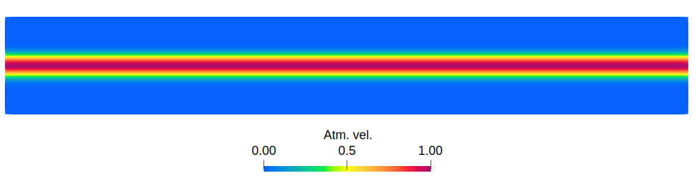
  
  <figcaption>Initial atmospheric temperature (top), atmospheric velocity (middle), and ocean temperature (bottom) fields at t=0. The ocean velocity is set to zero at t=0.</figcaption>
</figure>

<figure>
  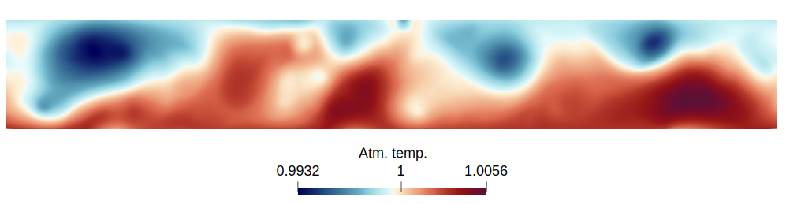
  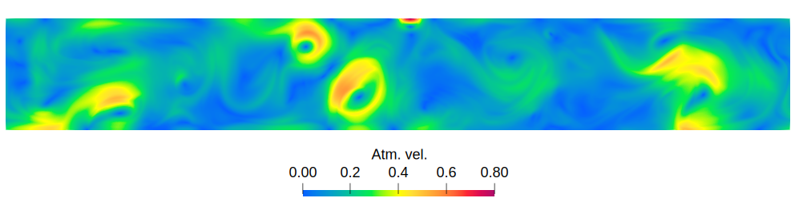
  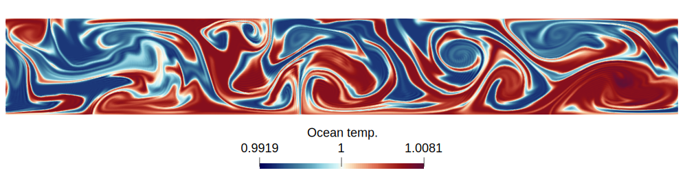
  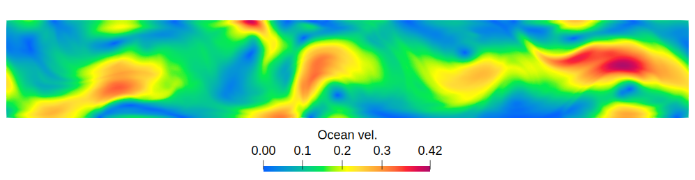
  <figcaption>Atmospheric (top two) and oceanic (bottom two) velocity and temperature fields at t = 25 for the deterministic climate model simulation on the 896x128 grid.</figcaption>
</figure>

<figure>
  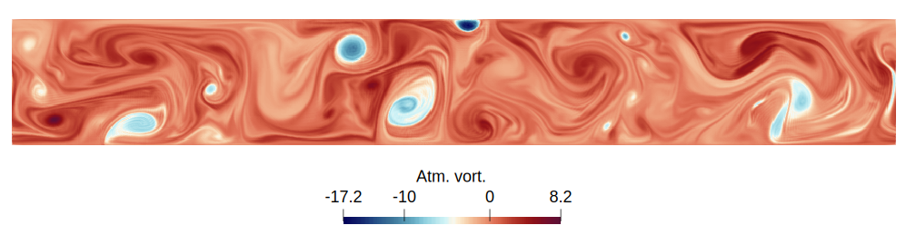
  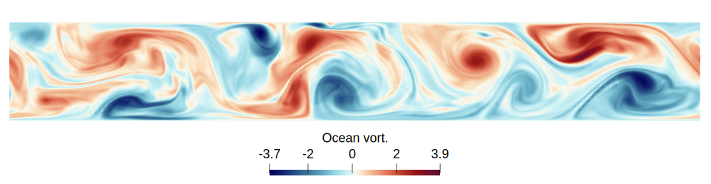
  <figcaption>Atmospheric vorticity (top) and ocean vorticity (bottom) fields at t=25 for the deterministic model simulation on the 896x128 grid.</figcaption>
</figure>

### Stochastic climate model
<figure>
  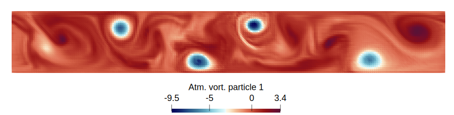
  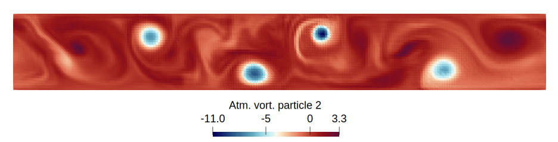
  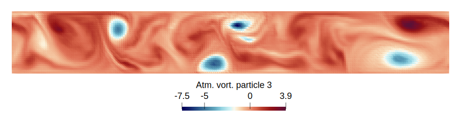
  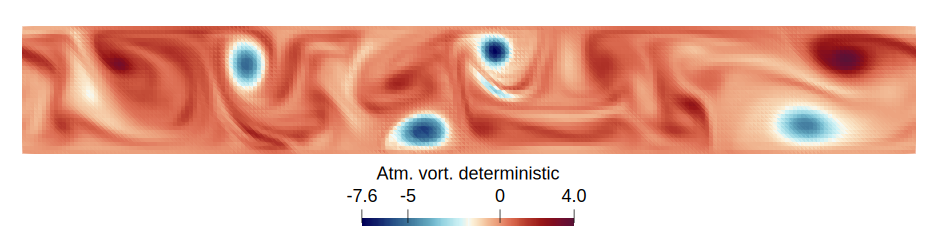
  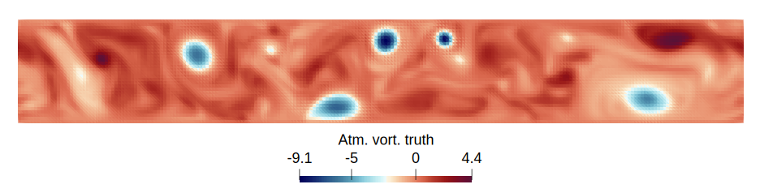
  <figcaption>Atmospheric vorticity fields from three independent realizations of the SPDE on the 224x32 grid at t = 35 (top three plots), compared with the deterministic model result (fourth plot) and the coarse-grained high-resolution solution (last plot).</figcaption>
</figure>

### Uncertainty quantification
<figure>
  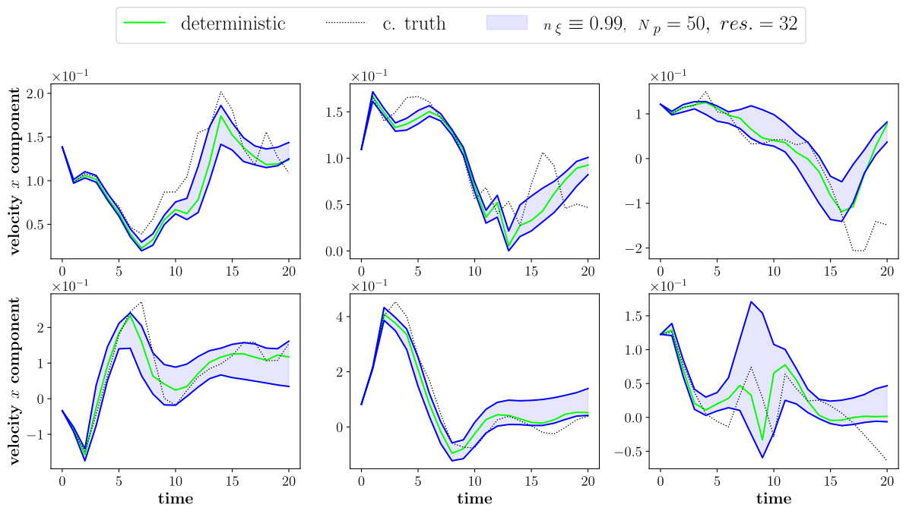
  <figcaption>Evolution of atmospheric velocity (x component) at six observation points on the grid over time (t=25 to t=45). The solution from the stochastic model is compared with the coarse-grained high-resolution solution (truth) and the deterministic model solution.</figcaption>
</figure>
<figure>
  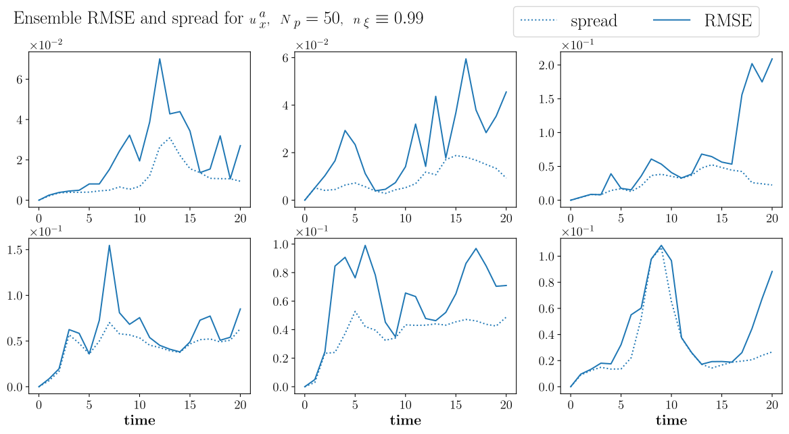
  <figcaption>Ensemble RMSE and spread of velocity (x component) at six observation points in the grid over time.</figcaption>
</figure>

### Stochastic versus deterministic ensemble
<figure>
  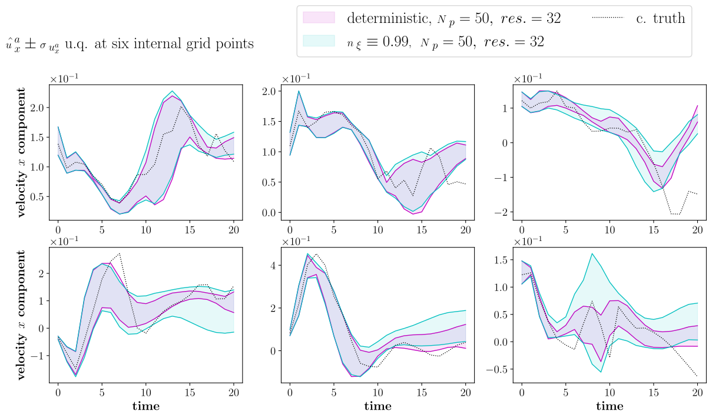
  <figcaption>Comparison of atmospheric velocity (x component) generated by the stochastic ensemble and the deterministic ensemble. Both ensembles start with same initial conditions (perturbed velocity fields at t=25). The stochastic model is parameterized using SALT.</figcaption>
</figure>
<figure>
  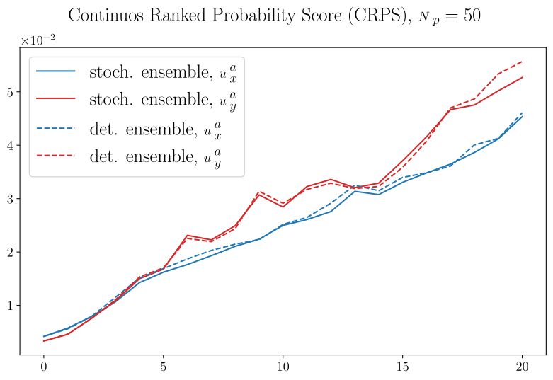
  <figcaption>CRPS plots comparing the performance of the stochastic ensemble and the deterministic ensemble.</figcaption>
</figure>